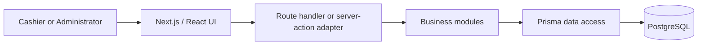

# Architecture

## Architectural style

Gadget POS is a modular monolith. The browser, Next.js server, and PostgreSQL database form a three-tier system, but the server is deployed as one application. This gives clear separation without the operational and communication complexity of microservices.

## Design goals

1. A team member can trace a request from screen to database.
2. Business rules live in business modules, not duplicated across screens and route handlers.
3. Operations that change sales and stock are transactional.
4. Authorization is checked on the server.
5. Interfaces are small and return useful results.
6. The database enforces identity and relationship constraints.

## Runtime view



## Module responsibilities

| Module    | Responsibility                                                      | Intended interface                                              |
| --------- | ------------------------------------------------------------------- | --------------------------------------------------------------- |
| Identity  | Authentication, sessions, and role checks                           | `requireUser`, `requireAdmin`                                   |
| Catalog   | Product identity, SKU/barcode, prices, and supplier association     | `createProduct`, `updateProduct`, `findProducts`                |
| Inventory | Stock changes, serialized gadgets, warranties, and movement history | `adjustStock`, `registerProductUnit`, `calculateWarrantyExpiry` |
| Sales     | Quotes, checkout, payments, receipts, voids, and refunds            | `quoteSale`, `completeSale`, `refundSale`                       |
| Customers | Customer details and purchase history                               | `createCustomer`, `updateCustomer`, `getCustomerHistory`        |
| Reporting | Read-only sales and inventory summaries                             | `getSalesSummary`, `getLowStockReport`                          |

These interfaces are the desired seams for new work. Existing route-level logic will be moved behind them incrementally rather than rewritten all at once.

## Source layout

```text
src/
  app/                  pages and transport adapters
  components/           presentation
  modules/              business modules (target location)
  lib/                  database, auth, formatting, and local storage
  store/                temporary browser cart state
  tests/                unit, integration, and browser tests
prisma/
  schema.prisma         relational data model
  migrations/           versioned schema changes
docs/                   requirements, models, decisions, and verification
```

## Checkout rules

The server is authoritative for product price, stock, tax rules, discounts, and payment validation. Checkout loads current products and executes a single database transaction that creates the sale and line items, assigns serialized product units, creates warranties, and updates stock. A failure rolls back the entire operation.

The browser cart is presentation state only; values sent by the browser are requests, not trusted facts.

## Data design principles

- Monetary values use fixed-precision database decimals.
- SKU, barcode, serial number, and IMEI are unique when present.
- Historical sale lines retain the product name and price used at the time of sale.
- Inventory changes have a reason, actor, timestamp, and related transaction when applicable.
- A product unit has one lifecycle state at a time.
- JSON is reserved for data that does not need relational constraints or reporting.

## Security

- Better Auth provides email/password sessions.
- ADMIN and CASHIER are the only MVP roles.
- Pages may hide unauthorized actions, but server-side checks provide enforcement.
- Request bodies are validated with Zod.
- Product price and stock are reloaded during checkout.
- Passwords and environment secrets are not committed.

## Deployment

The supported course deployment consists of one Next.js container and one PostgreSQL container using Docker Compose. Product images use local server storage. This is suitable for demonstration and keeps the operational model clear.

## Quality strategy

- Pure unit tests cover calculations and state transitions.
- Database-backed integration tests cover module interfaces and transactions.
- Playwright tests cover a small number of critical user journeys.
- The traceability matrix prevents tests from becoming disconnected from requirements.

## Known transition work

The inherited baseline still contains some business logic in route handlers and large UI files. It will be moved into the listed modules only when a related requirement is implemented. This avoids a high-risk rewrite and gives each refactor a testable purpose.
