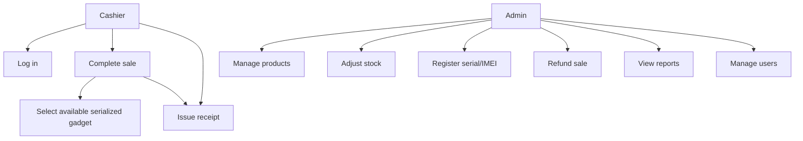
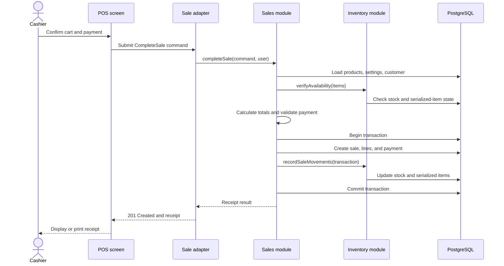
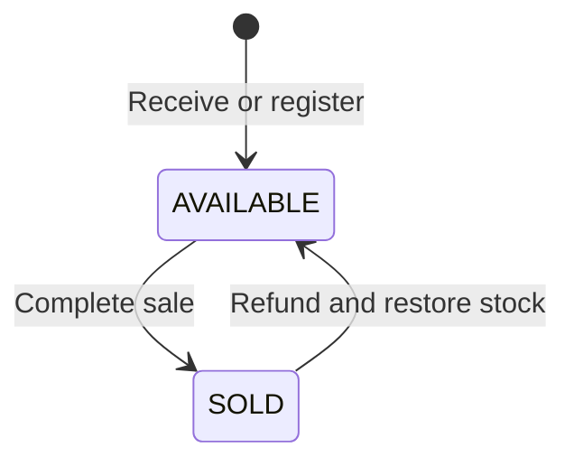
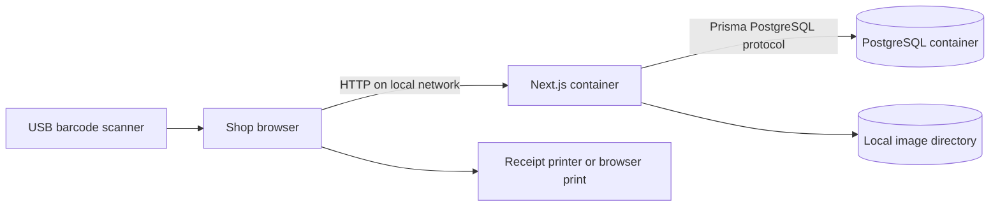

# UML and data diagrams

These are living design models and use the same terms as `CONTEXT.md` and the implemented Prisma schema.

## System context

```mermaid
flowchart LR
    Cashier[Cashier] --> POS[Gadget POS]
    Admin[Administrator] --> POS
    POS --> Customer[Customer receipt and warranty]
    POS --> DB[(PostgreSQL database)]
    Scanner[Barcode/IMEI scanner] --> POS
    Printer[Receipt printer] <-- POS
```

## Main use cases



## Complete-sale sequence



## Domain class model

```mermaid
classDiagram
    User "1" --> "0..*" Sale : completes
    Supplier "1" --> "0..*" Product : supplies
    Product "1" --> "0..*" ProductUnit : identifies
    Product "1" --> "0..*" StockAdjustment : adjusted by
    Customer "1" --> "0..*" Sale : places
    Sale "1" *-- "1..*" SaleItem : contains
    Sale "1" --> "0..*" Refund : may have
    SaleItem "0..1" --> "0..1" ProductUnit : assigns
    SaleItem "1" --> "0..1" Warranty : creates

    Product {
      string id
      string name
      string sku
      decimal price
      int stock
      ProductTrackingMode trackingMode
      int warrantyMonths
    }
    ProductUnit {
      string id
      string serialNumber
      string imei
      ProductUnitStatus status
    }
    Sale {
      string id
      decimal subtotal
      decimal taxAmount
      decimal total
      SaleStatus status
      datetime createdAt
    }
    SaleItem {
      string id
      string productName
      decimal unitPrice
      int quantity
    }
    Warranty {
      string id
      datetime startsAt
      datetime expiresAt
      WarrantyStatus status
    }
```

## Serialized-item lifecycle



## Deployment



## Diagram review checklist

Before submission, verify that entity names match Prisma, message names match implemented module interfaces, states match validation rules, and every arrow represents a real dependency or interaction.
